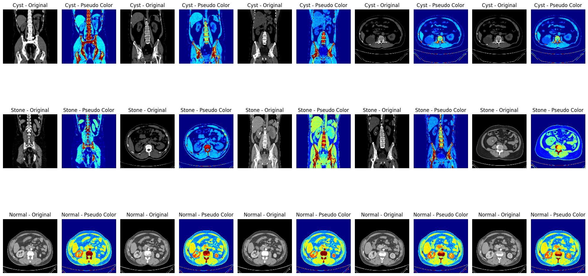
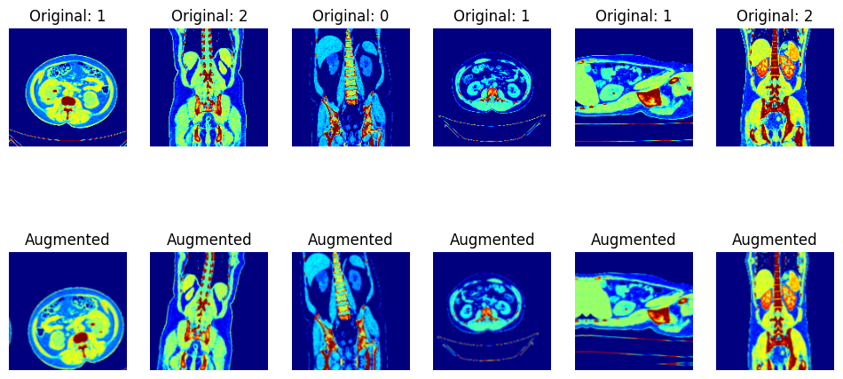

# CyStoneNet: Pseudo-Color Enhanced SE-Attention MobileNetV2 for Kidney Stone and Cyst Detection

[](https://ieeexplore.ieee.org/document/11491240)
[](https://ieeexplore.ieee.org/document/11491240)
[](https://www.python.org/)
[](https://www.tensorflow.org/)
[](https://opensource.org/licenses/MIT)

**Official implementation of our research paper published in IEEE Xplore (ICCIT 2025).**

📄 **Read the Published Paper:**  
👉 https://ieeexplore.ieee.org/document/11491240

---

## Authors

**Jerin Sultana**, **Joyita Sen**, **Nowshin Tasnim**, and **Mohammed Mahmudur Rahman**

**Institution:**  
Department of Computer Science and Engineering  
University of Science and Technology Chittagong (USTC), Bangladesh

---

## Abstract

Early and precise identification of renal abnormalities is crucial for effective clinical decision-making. This article proposed a lightweight framework for the detection of kidney disease from computed tomography scans.

By applying pseudo-color modification to grayscale CT scans, the technique improves textural and spatial information that is sometimes missed in the conventional grayscale format. Moreover, the MobileNetV2 architecture is incorporated with a squeeze-and-excitation (SE) attention mechanism to adaptively highlight the most discriminative channel-wise features.

The proposed framework accurately classifies medical images into three distinct diagnostic categories:

- **Normal**
- **Cyst**
- **Stone**

---

## Proposed Architecture

The proposed **CyStoneNet** framework integrates pseudo-color enhancement with an SE-attention-enhanced MobileNetV2 architecture for kidney CT image classification.

<p align="center">
  
</p>

### Key Components

1. **Grayscale CT Image**
2. **Pseudo-Color Enhancement**
3. **Data Augmentation**
4. **MobileNetV2 Backbone**
5. **Squeeze-and-Excitation (SE) Attention**
6. **Global Feature Extraction**
7. **Classification Layer**
8. **Three-Class Prediction: Normal, Cyst, Stone**

---

## Preprocessing & Data Augmentation

### 1. Pseudo-Color Enhancement

To improve the textural and spatial information of the medical scans, grayscale CT scans are transformed into enhanced pseudo-color representations using OpenCV's **JET colormap**.

The transformation is applied across the three diagnostic categories:

- **Cyst**
- **Stone**
- **Normal**

<p align="center">
  
</p>

Pseudo-color enhancement allows intensity variations in grayscale CT images to be represented through different color levels, helping the network learn additional spatial and textural patterns.

---

### 2. Data Augmentation

To improve the generalization capability of the model and reduce the risk of overfitting, several data augmentation techniques were applied to the pseudo-color enhanced images.

The augmentation process includes spatial transformations such as:

- Rotation
- Horizontal flipping
- Zooming
- Shearing
- Brightness variation

<p align="center">
  
</p>

These transformations increase the diversity of training samples while preserving the clinically relevant characteristics of the CT images.

---

## Model Architecture

The core classification network is based on **MobileNetV2**, a lightweight convolutional neural network designed for efficient feature extraction.

To improve the discriminative capability of the network, a **Squeeze-and-Excitation (SE) attention mechanism** is integrated into the architecture.

### MobileNetV2

MobileNetV2 provides:

- Lightweight computation
- Efficient feature extraction
- Reduced number of parameters
- Suitable performance for medical image classification
- Better computational efficiency compared with many heavyweight CNN architectures

### Squeeze-and-Excitation Attention

The SE attention mechanism adaptively recalibrates channel-wise feature responses.

It enables the network to:

- Identify informative feature channels
- Suppress less useful features
- Emphasize discriminative patterns
- Improve representation learning

The combination of **pseudo-color enhancement + MobileNetV2 + SE attention** forms the proposed **CyStoneNet** framework.

---

## Classification Categories

The proposed model performs three-class classification:

| Class | Description |
|-------|-------------|
| **Normal** | Normal kidney CT images |
| **Cyst** | Kidney cyst cases |
| **Stone** | Kidney stone cases |

---

## Repository Structure

```text
CyStoneNet/
│
├── architecture_flowchart.png
│   └── Workflow and architecture diagram
│
├── preprocessing_samples.png
│   └── Original vs pseudo-color enhanced images
│
├── data_augmentation.png
│   └── Data augmentation visualization
│
├── mobilenet_with_pseudocolor_enhancement.py
│   └── Complete model implementation
│
└── README.md
    └── Project documentation
