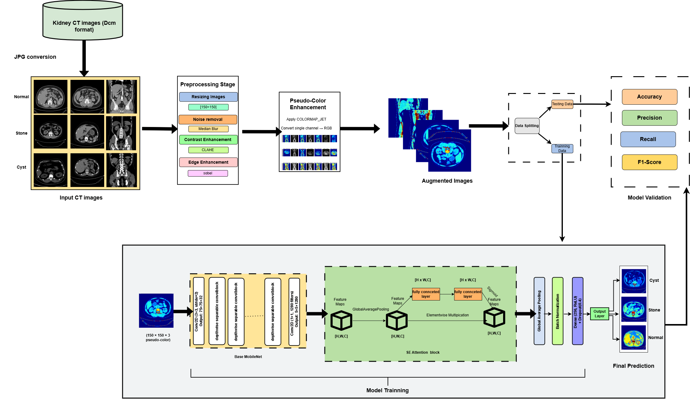

# CyStoneNet: Pseudo-Color Enhanced SE-Attention MobileNetV2 for Kidney Stone and Cyst Detection

[](https://ieeexplore.ieee.org/document/11491240)
[](https://www.python.org/)
[](https://pytorch.org/)
[](https://opensource.org/licenses/MIT)

Official PyTorch implementation of our research paper published in **IEEE Xplore (ICCIT 2025)**.

**Authors:** Jerin Sultana, Joyita Sen, Nowshin Tasnim, and Mohammed Mahmudur Rahman  
**Institution:** University of Science and Technology Chittagong (USTC)

---

## Abstract
Early and precise identification of renal abnormalities is crucial for effective clinical decision-making. This article proposed a lightweight framework for the detection of kidney disease from computed tomography scans. By applying pseudo-color modification to grayscale CT scans, the technique improves textural and spatial information that is sometimes missed in the conventional grayscale format. Moreover, the MobileNetV2 architecture is incorporated with a squeeze-and-excitation (SE) attention mechanism to adaptively highlight the most discriminative channel-wise features, accurately classifying medical images into three distinct diagnostic categories: **Normal**, **Cyst**, and **Stone**.

---

## Proposed Architecture
<p align="center">
  
</p>

---

## Repository Structure
```text
CyStoneNet/
│
├── dataset/                  # Dataset description and sample links
├── preprocess/               # Pseudo-color enhancement scripts
├── models/                   # MobileNetV2 + SE-Attention network architecture
├── weights/                  # Pre-trained model weights (.pth)
├── architecture_flowchart.png# Workflow/Architecture diagram
├── train.py                  # Training script
├── evaluate.py               # Evaluation and performance metrics script
├── requirements.txt          # Required Python packages
└── README.md                 # Project documentation
